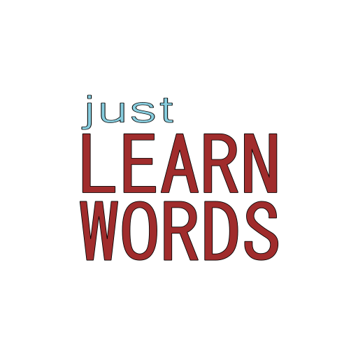

<p align="center">
    
</p>

justLearnWords
---

A tiny tool for people who want to learn words, not manage them.

- Tired of cluttered interface?
- Tired of endless configuration?
- You feel that you’re managing a database instead of learning words?

justLearnWords is just for you!

- Zero friction
- Minimal interface
- No cloud/blockchain/AI bullshit

Clone and run
---

### Clone
```
git clone https://github.com/darkclif/LearnWords
```

### Run
```
py learn.py 
- Interactive mode when you choose file from 'pkg' folder

py learn.py path/to/file.txt 
- Learn specific file
```

### Add
To add file with new words you should create TXT file with format:

```
word1_en;word1_it;0.0
word2_en;word2_it;0.0
...
```

- word1_en - Word in first language
- word1_it - Word in second language
- 0.0 - Starting weight, this will change during learning sessions.

Features
---

- Each word pair has weight assigned to it, it stays in range 0.0 to 1.0.
    - Values closer to 1.0 means you know the word.
    - Values closer to 0.0 means you do not.
- When you guess the word:
    - Correctly - adds 0.06 to weight.
    - Incorrectly - substracts 0.03 from weight.
- You can check average weight for given file from within interactive mode.
